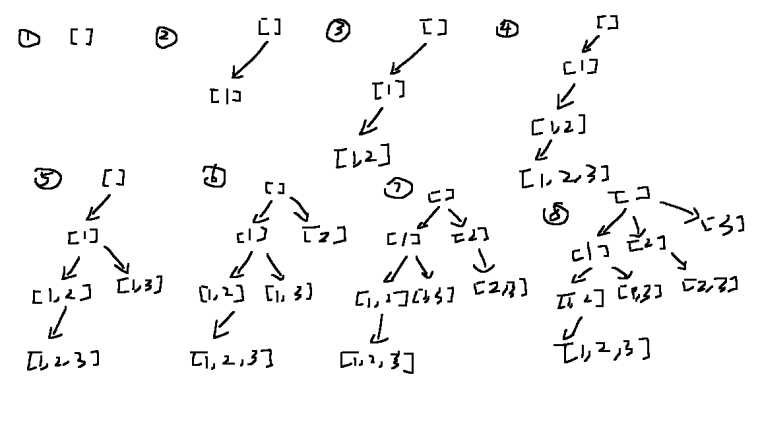

# Notes
- Try to make a tree and branches. Then accordingly decide how to write code.

  
  The other one is the swapping based solution. Notice that in the swapping based solution, **you modify the given array or string**.

## Backtracking
In the backtracking process, notice that in each step, move id a step forward(Subsets) or keep it same(Combination Sum).
This helps to avoid duplicates according to order e.g (1,3) and (3,1) Check [here](https://www.youtube.com/watch?v=XovjRfHumDU)





## Permutations

Swapping is based on

Basic idea: permutation of A[1..n] equals to
A[1] + permutation of (A[1..n] - A[1])
A[2] + permutation of (A[1..n] - A[2])
...
A[n] + permutation of (A[1..n] - A[n]).
``` 
//Swapping based permutation solution which is much more intuitive.
class Solution {
public:
    void permuteHelper(vector<vector<int>>& res, vector<int>& nums, int begin)
    {
        if(begin >= nums.size())
        {
            res.push_back(nums);
            return;
        }
        for(int i = begin; i < nums.size(); i++)
        {
            swap(nums[i], nums[begin]);
            permuteHelper(res,nums,begin+1);
            swap(nums[i],nums[begin]);
        }
    }
    vector<vector<int>> permute(vector<int>& nums) {
        
        vector<vector<int>> res;
        int begin = 0;
        permuteHelper(res, nums, begin);
        return res;
    }
};
```
