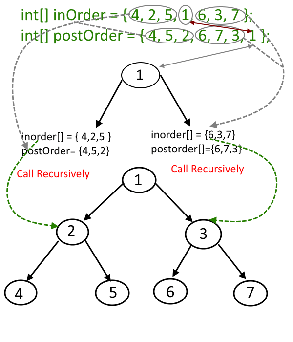

# Trees

Take a paper. Figure out how to traverse
- Do I need to touch the leaf nodes?
- Do i need to compare two nodes? Is a helper function required?
- Most of the times, inorder traversal helps.
- Want to process left,right children data from bottom first --> postorder traversal
- Views --> level order

## Common Patterns

### Clever use of stack and queues
- Exploit stack's Last in first out feature e.g in spiral order traversal
- Queue itself is used for bfs

### Construction based questions
- Do some easy math to decide the start of preorder, postorder indices etc.
- For BST, utlize it's properties mostly.
- 

### Get some information from the children
- In such questions like maxdepth, tilt of a binary tree, minimum depth, we are supposed to get some information from the children.
- Important task to decide how to propagate information upwards. e.g tilt of a binary tree.
- Maxdepth is a classic example of using dfs to get information from leaf nodes.
- In tilt of a binary tree, we use postorder traversal so that we have information of both the left and right 
  child by the time we reach the root node.
  
  
### Traversal based questions
- Level order traversal variations like zig-zag traversal
- Decide on the type of traversal and how the flow of information should be.

### 2 tree comparison questions
- Helper function helps a lot
